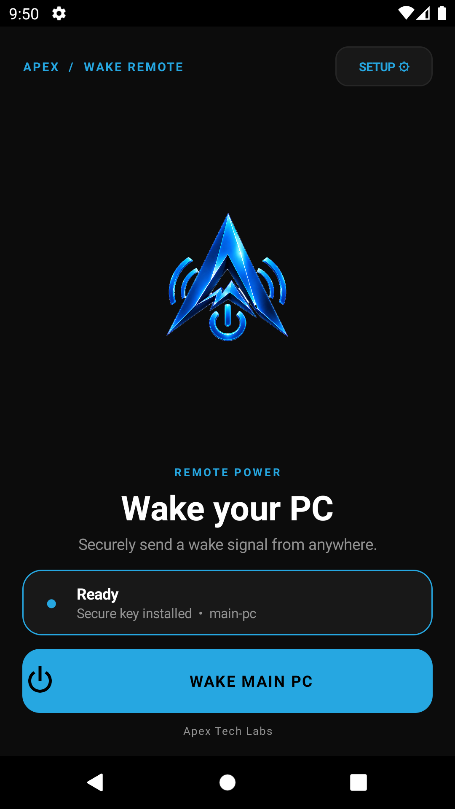
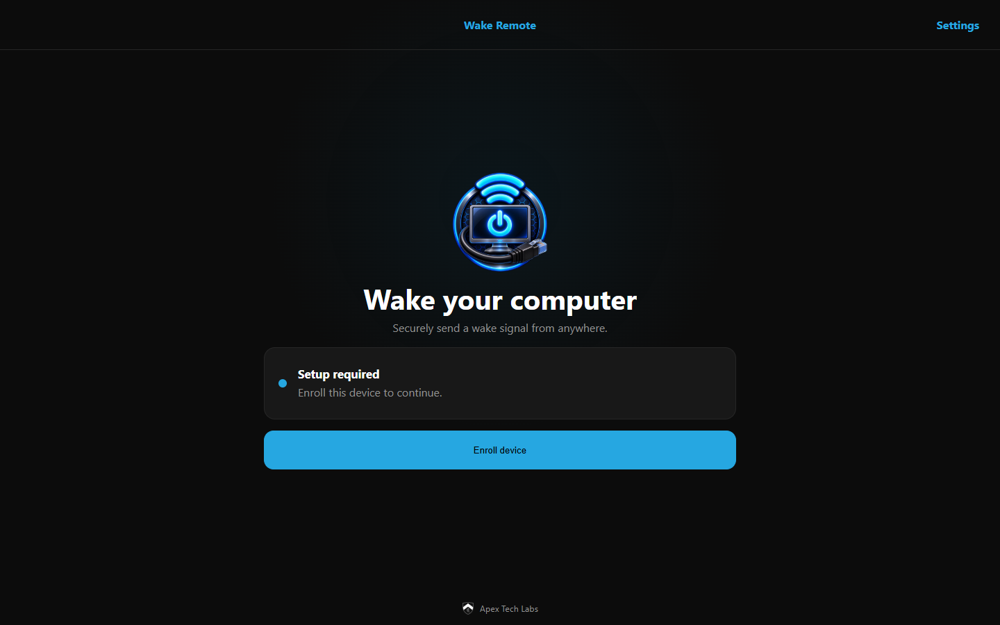

# Wake Remote

Wake Remote securely triggers Wake-on-LAN from Android, Windows, or an installable PWA. A small self-hosted server receives HMAC-SHA256 authenticated requests and emits the magic packet on the target network. Targets are defined only on the server; clients never submit a MAC address or destination IP.

> [!IMPORTANT]
> Wake-on-LAN requires an always-on device on the target's LAN to emit the packet. Use a Raspberry Pi, NAS, container-capable router, always-on PC, or an off-site server connected to the LAN by WireGuard/Tailscale. There is no client-only workaround.

## Apps

- `server/`: one multi-platform Python container/bare-metal backend for Windows, Linux, Raspberry Pi, NAS, and Docker hosts.
- `android/`: native Android client with Keystore-protected enrollment and QR scanning.
- `windows/`: .NET 8 WPF client with DPAPI storage, tray action, login option, and `Ctrl+Alt+W` hotkey.
- `pwa/`: installable web client using a non-extractable Web Crypto key in IndexedDB.

## Screenshots

| Android | PWA / desktop design |
|---|---|
|  |  |

## Requirements

The target must have Wake-on-LAN enabled in BIOS/UEFI, **Wake on Magic Packet** enabled on its wired adapter, and the adapter permitted to wake the computer. Wired Ethernet is strongly preferred. Disable Windows Fast Startup if waking from shutdown is unreliable.

For remote+tunnel mode, create a static router IP/MAC binding because a sleeping NIC cannot refresh ARP. LAN-resident mode uses the subnet broadcast address and needs no static binding.

## Server installation

Copy `server/`, set `WAKE_SERVER_URL` to the public origin, and set `WAKE_TARGETS_JSON` to the server-side target list. The Compose defaults are safe sample values that must be replaced before a real wake.

```powershell
cd server
docker compose up -d --build
docker compose logs wake-remote
```

The first start generates a persistent `wake.key` with restrictive permissions and prints a 10-minute enrollment URI plus terminal QR. Replace the sample `WAKE_TARGETS_JSON` configuration and restart. `docker-compose.yml` binds to loopback by default; put Caddy, Nginx Proxy Manager, Traefik, or nginx in front of it. Remove `ports` and join the proxy's Docker network when the proxy is containerized.

For bare metal, install Python 3.13+, set `WAKE_DATA_DIR`, then run `python -m wake_remote.app`. Windows, Linux, and Raspberry Pi use the same server code. LAN-only HTTP requires `WAKE_ALLOW_INSECURE_ENROLLMENT=true`; HMAC authenticates requests but does not encrypt credentials, so HTTPS or a private tunnel is strongly recommended.

Two deployment modes are supported:

1. LAN-resident: set each target `address` to the subnet broadcast address, for example `192.168.1.255`.
2. Remote+tunnel: set each target `address` to its fixed unicast address and configure a static IP/MAC binding on the router.

## Client installation and enrollment

- Android: build/install the release APK from `android/` or download it from a tagged release.
- Windows: run the installer or portable self-contained EXE from a tagged release.
- PWA: serve `pwa/dist` over HTTPS, open it, and choose the browser's Install action.

Scan the short-lived QR shown at server setup. The client exchanges its single-use token over TLS, receives the key and target list, and burns the token. Manual entry accepts exactly 64 hexadecimal characters and is intentionally secondary.

## Security model

The exact compact body is hashed, then the method, path, Unix timestamp, fresh nonce, and body hash are signed with HMAC-SHA256. The server enforces ±60-second clock skew, 120-second nonce replay protection, authenticated and unauthenticated rate limits, 1 KiB bodies, and server-side-only target addresses. A `204` means the server transmitted the packet; it does **not** mean the computer booted. In-memory replay/rate state requires a single replica.

Android uses Android Keystore; Windows uses current-user DPAPI. The PWA uses a non-extractable `CryptoKey`, but browser storage is not equivalent to an OS hardware keystore: use the native apps for higher-risk endpoints. Never publish the data directory or commit keys.

## Configuration

| Setting | Default | Purpose |
|---|---|---|
| `WAKE_DATA_DIR` | `/data` | Persistent configuration and generated key directory |
| `WAKE_KEY_FILE` | `/data/wake.key` | Signing-key path |
| `WAKE_CONFIG_FILE` | `/data/targets.json` | Target list |
| `WAKE_KEY_ID` | `main` | Client key identifier |
| `WAKE_SERVER_URL` | `http://localhost:8080` | Origin embedded in enrollment links |
| `WAKE_BIND` / `WAKE_PORT` | `0.0.0.0` / `8080` | Listener |
| `WAKE_ALLOW_INSECURE_ENROLLMENT` | `false` | Explicit LAN HTTP opt-in |
| `WAKE_NOTIFY_WEBHOOK_URL` | empty | Generic JSON webhook |
| `WAKE_NOTIFY_TELEGRAM_TOKEN` / `WAKE_NOTIFY_TELEGRAM_CHAT_ID` | empty | Telegram notification |
| `WAKE_NOTIFY_NTFY_URL` | empty | ntfy topic URL |
| `WAKE_NOTIFY_AUTH_FAILURES` | `false` | Alert on failed authentication |
| `WAKE_ALLOWED_ORIGINS` | `*` | Comma-separated PWA origins allowed by CORS; restrict in production |

Target keys are `alias`, `label`, `address`, `mac`, and optional `port` (default 9).

## Troubleshooting

- `401`: re-enroll, enable automatic date/time, and verify canonical bytes against `shared/test-vectors.json`.
- `429`: wait for `Retry-After`; do not retry a signed request with the same nonce.
- `204` but no wake: verify BIOS/NIC settings; in remote+tunnel mode verify static ARP/IP-MAC binding and tunnel routing.
- `503`: the server could not send to the configured target network.
- Key rotation: overwrite a bind-mounted key **in place** with `cp`; replacing the inode can leave a running container on the old key until recreation.

See [protocol](docs/protocol.md), [deployment](docs/deployment.md), and [release verification](docs/release.md).

## Build and validation

Pull requests run server integration tests, Android tests and lint, Windows protocol tests, and PWA tests, lint, and builds. Tags matching `v*` publish the signed Android APK, Windows portable and installer executables, PWA archive, and multi-architecture server image. Configure the Android signing secrets described in [release verification](docs/release.md) before creating a production tag.

For a complete local installation and live acceptance run, follow [the Claude handoff](docs/CLAUDE-HANDOFF.md). It records prerequisites, exact build commands, artifact locations, secure enrollment, and the hardware/network test matrix.

## License

MIT. See [LICENSE](LICENSE).
