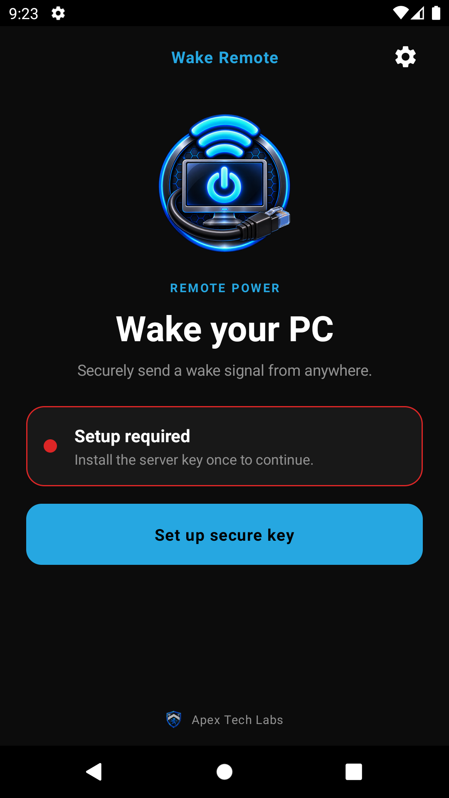
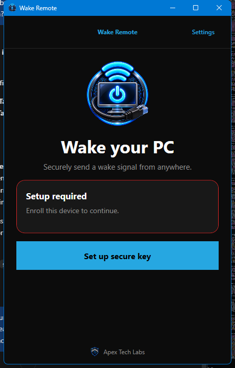
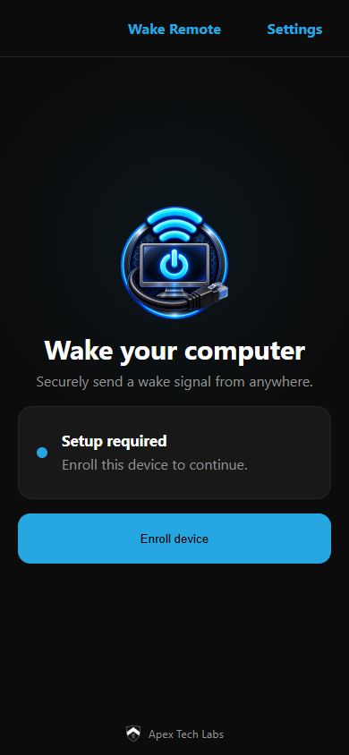
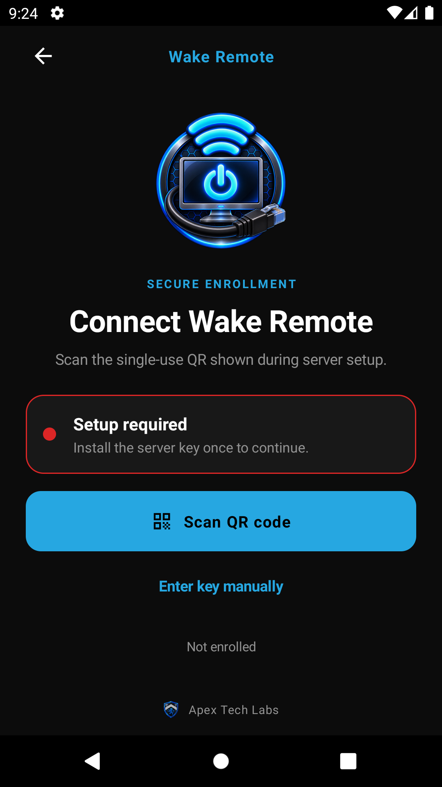
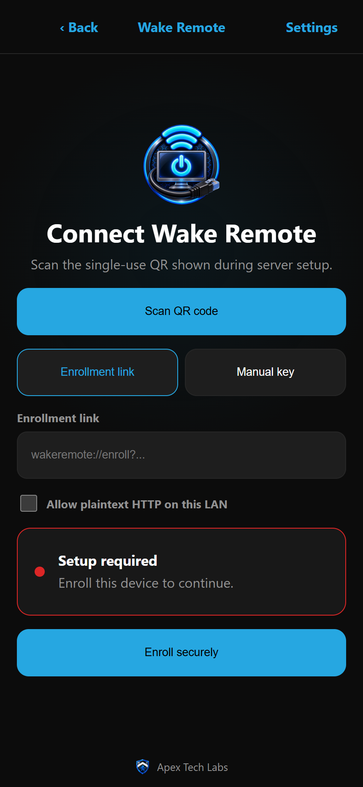

# Wake Remote

Wake Remote securely triggers Wake-on-LAN from Android, Windows, or an installable PWA. A
small self-hosted server verifies HMAC-SHA256 signed requests and emits the magic packet on
the target's network. Targets are defined only on the server; clients never submit a MAC
address or destination IP.

The server also serves the PWA at the origin root, so one container provides both the app
and the API. The API lives under `/api`.

> [!IMPORTANT]
> Wake-on-LAN requires an always-on device **on the target's LAN** to emit the packet. Use a
> Raspberry Pi, NAS, container-capable router, an always-on PC, or an off-site host joined to
> the LAN by WireGuard/Tailscale. There is no client-only workaround.

## Apps

- `server/`: one multi-platform Python backend for Linux, Raspberry Pi, NAS, and Docker hosts.
- `android/`: native Android client with Keystore-protected enrollment and QR scanning.
- `windows/`: .NET 8 WPF client with DPAPI storage, tray action, login option, and `Ctrl+Alt+W`.
- `pwa/`: installable web client using a non-extractable Web Crypto key in IndexedDB.

## Screenshots

| Android | Windows | PWA |
|---|---|---|
|  |  |  |

Enrollment is QR-first on every client:

| Android enrollment | PWA enrollment | Windows tray |
|---|---|---|
|  |  |  |

See [docs/screenshots](docs/screenshots/README.md) for how these were captured and what is
still worth capturing on real hardware.

## Requirements

**An always-on device on the target's LAN** must run the server or forward the packet. This
is not optional: a sleeping machine cannot be reached from the internet directly.

On the **target** computer:

- Enable Wake-on-LAN in BIOS/UEFI (often "Power On By PCI-E/PCI" or "Wake on LAN").
- Enable **Wake on Magic Packet** on the network adapter, and allow the adapter to wake the
  computer. On Windows: Device Manager, adapter, Properties, then Advanced and Power Management.
- **Wired Ethernet is strongly preferred.** Wake-on-Wireless needs specific adapter and router
  support and often does not survive a full shutdown.
- Disable Windows **Fast Startup** if waking from a full shutdown is unreliable, since it
  leaves the NIC in a state that ignores magic packets.

For remote+tunnel mode, create a static router IP/MAC binding: a sleeping NIC cannot refresh
ARP, so the router forgets where to send the packet. LAN-resident mode uses the subnet
broadcast address and needs no static binding.

## Install

### Server

Either pull the published image:

```bash
docker pull ghcr.io/sethrickert/wake-remote-server:v1.0.2
```

or download `wake-remote-server-1.0.2.tar.gz` from the release, which additionally contains
the built PWA and a deploy README:

```bash
tar xzf wake-remote-server-1.0.2.tar.gz
cd wake-remote-server-1.0.2
cp -r dist pwa-dist
WAKE_SERVER_URL=https://wol.example.com WAKE_STATIC_DIR=/srv/pwa docker compose up -d --build
docker compose logs wake-remote
```

The first start generates a persistent `wake.key` with restrictive permissions and prints a
10-minute enrollment URI plus a terminal QR. Replace the sample `WAKE_TARGETS_JSON` and
restart before a real wake. `docker-compose.yml` binds to loopback by default; put Caddy,
Nginx Proxy Manager, Traefik, or nginx in front of it, and remove `ports` and join the
proxy's network when the proxy is containerized.

For bare metal, install Python 3.13+, set `WAKE_DATA_DIR`, then run `python -m wake_remote.app`.
LAN-only HTTP requires `WAKE_ALLOW_INSECURE_ENROLLMENT=true`; HMAC authenticates requests but
does not encrypt them, so HTTPS or a private tunnel is strongly recommended.

Two deployment modes are supported:

1. **LAN-resident**: set each target `address` to the subnet broadcast address, e.g. `192.168.1.255`.
2. **Remote+tunnel**: set each target `address` to its fixed unicast address and configure a
   static IP/MAC binding on the router.

### Clients

- **Android**: install `WakeRemote.apk` from a tagged release. If an older build is already
  installed, uninstall it first.
- **Windows**: run `WakeRemote-Setup-1.0.2-x64.exe`, or `WakeRemote-Portable.exe` for a
  self-contained build that needs no installation. The portable exe is a single file and runs
  from any folder.
- **PWA**: open the server's URL and choose the browser's Install action. If the root URL
  shows a JSON 404 instead of the app, `WAKE_STATIC_DIR` is not set. See Troubleshooting.

## Enrollment

**QR is the primary path; a manual key is the backup.**

1. The server prints a single-use `wakeremote://enroll?v=1&url=<origin>&t=<token>` URI and a
   terminal QR at first start, or on demand with `python -m wake_remote.app --enroll`.
2. Scan it: Android opens the camera from **Scan QR code**, the PWA uses the browser's
   barcode detector, and Windows accepts the link pasted from any scanner.
3. The client exchanges the token over TLS for the key and the target list, and the token is
   burned. The key is stored in the Android Keystore, Windows DPAPI, or a non-extractable
   `CryptoKey` in IndexedDB.

Tokens expire after 10 minutes and are single-use. Manual entry accepts exactly 64
hexadecimal characters and is intentionally secondary. The `url=` parameter is the bare
origin; clients append `/api/v1/enroll` themselves.

## Security model

The exact compact body is hashed, then the method, path, Unix timestamp, fresh nonce, and
body hash are joined by LF with no trailing LF and signed with HMAC-SHA256:

```
POST\n/api/v1/wake\n<unix seconds>\n<nonce hex>\n<sha256 of body, hex>
```

Headers are `X-Key-Id`, `X-Timestamp`, `X-Nonce`, and `X-Signature`. The server enforces a
plus/minus 60-second clock-skew window, 120-second single-use nonce replay protection,
authenticated and unauthenticated rate limits, 1 KiB bodies, and server-side-only target
addresses.

**A `204` means the server transmitted the packet. It does not mean the computer booted**:
nothing acknowledges a magic packet. In-memory replay and rate-limit state requires a
**single replica**.

Android uses the Android Keystore and Windows uses current-user DPAPI. The PWA's key is
non-extractable, but browser storage is not equivalent to an OS keystore: prefer the native
apps for higher-risk endpoints. Never publish the data directory or commit keys.

The signed path is part of the canonical string, so it must match byte-for-byte across the
server and all three clients. `shared/test-vectors.json` is the authoritative known-answer
fixture, and every client's test suite reads it.

## Configuration

| Setting | Default | Purpose |
|---|---|---|
| `WAKE_DATA_DIR` | `/data` | Persistent configuration and generated key directory |
| `WAKE_KEY_FILE` | `/data/wake.key` | Signing-key path |
| `WAKE_CONFIG_FILE` | `/data/targets.json` | Target list |
| `WAKE_TARGETS_JSON` | empty | Inline target list; takes precedence over the file |
| `WAKE_KEY_ID` | `main` | Client key identifier, sent as `X-Key-Id` |
| `WAKE_SERVER_URL` | `http://localhost:8080` | Origin embedded in enrollment links |
| `WAKE_STATIC_DIR` | empty | Directory holding the built PWA. **Empty disables static serving**, and the root URL returns a JSON 404 |
| `WAKE_BIND` / `WAKE_PORT` | `0.0.0.0` / `8080` | Listener |
| `WAKE_ALLOW_INSECURE_ENROLLMENT` | `false` | Explicit LAN HTTP opt-in |
| `WAKE_ALLOWED_ORIGINS` | `*` | Comma-separated CORS origins; restrict in production |
| `WAKE_NOTIFY_WEBHOOK_URL` | empty | Generic JSON webhook |
| `WAKE_NOTIFY_TELEGRAM_TOKEN` / `WAKE_NOTIFY_TELEGRAM_CHAT_ID` | empty | Telegram notification |
| `WAKE_NOTIFY_TELEGRAM_PARSE_MODE` | empty | `Markdown` or `HTML` for Telegram messages |
| `WAKE_NOTIFY_NTFY_URL` | empty | ntfy topic URL |
| `WAKE_NOTIFY_TEMPLATE` | `Wake Remote: {event} ({target})` | Notification text; `{event}`, `{target}`, `{label}` |
| `WAKE_NOTIFY_AUTH_FAILURES` | `false` | Alert on failed authentication |

Target keys are `alias`, `label`, `address`, `mac`, and optional `port` (default 9).

### Routes

| Request | Result |
|---|---|
| `GET /healthz`, `GET /api/healthz` | `200 {"status":"ok"}` |
| any `GET` under `/api/` | JSON `404`, never the SPA |
| `GET` matching a file under `WAKE_STATIC_DIR` | that file |
| any other `GET` | `index.html`, so client-side routes deep-link |
| `POST /api/v1/wake` | signed wake, `204` on success |
| `POST /api/v1/enroll` | single-use token exchange |

`/healthz` is deliberately outside `/api` so container healthchecks, reverse proxies and
uptime monitors do not need to know about the prefix.

## Troubleshooting

- **The root URL shows JSON instead of the app**: `WAKE_STATIC_DIR` is unset, or points at a
  directory with no `index.html`. The API under `/api` works either way.
- **`204` but the computer does not wake**: the packet was sent, so the problem is on the
  target or the network. Re-check BIOS/UEFI WOL, Wake on Magic Packet, and Fast Startup. In
  remote+tunnel mode verify the static router IP/MAC binding and tunnel routing. A sleeping
  NIC cannot refresh ARP, so without a binding the router drops the packet.
- **`401`**: the signature did not verify. Causes, in rough order of likelihood: device clock
  drift beyond the 60-second window (enable automatic date and time), a stale enrollment from
  before the `/api` migration, a replayed nonce, or a `WAKE_KEY_ID` mismatch. Verify canonical
  bytes against `shared/test-vectors.json`.
- **`404` on a wake**: the target alias is not configured on the server.
- **`429`**: wait for `Retry-After`. Do not retry a signed request with the same nonce; sign a
  fresh one.
- **`503`**: the server could not send to the configured target network.
- **Key rotation**: overwrite a bind-mounted key **in place** with `cp`. Replacing the inode
  can leave a running container on the old key until it is recreated.

See [protocol](docs/protocol.md), [deployment](docs/deployment.md), and
[release verification](docs/release.md).

## Build and validation

```bash
PYTHONPATH=server python -m unittest discover -s server/tests   # server
./gradlew -p android test lint assembleRelease                  # android
dotnet test windows/WakeRemote.Tests/WakeRemote.Tests.csproj    # windows
cd pwa && npm ci && npm test && npm run lint && npm run build   # pwa
```

Pull requests run all four. Tags matching `v*` publish `WakeRemote.apk`,
`WakeRemote-Portable.exe`, `WakeRemote-Setup-<version>-x64.exe`, `WakeRemote-PWA.zip`, a
`wake-remote-server-<version>.tar.gz`, and a multi-architecture server image. Configure the
Android signing secrets described in [release verification](docs/release.md) before creating
a production tag.

Icons for every platform are generated from the masters in `/images` by
`tools/generate-icons.py`. Do not hand-edit the generated files.

## License

MIT. See [LICENSE](LICENSE).
